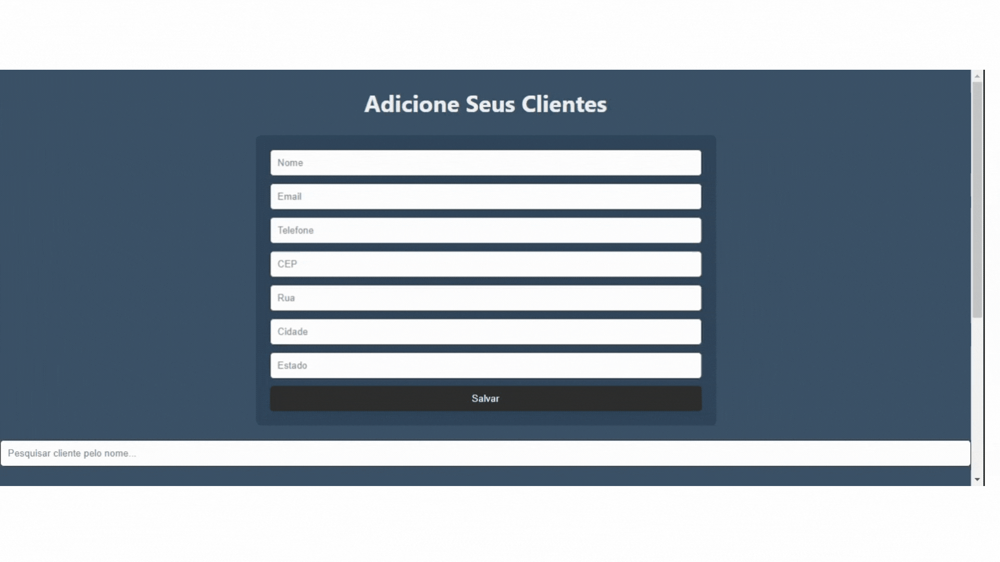

# Gerenciamento de Clientes com React

Este projeto é uma aplicação web desenvolvida com React que permite aos usuários gerenciar informações de clientes através de operações CRUD (Create, Read, Update, Delete). A aplicação se integra a uma API de backend para realizar essas operações sobre os dados dos clientes. Além das funcionalidades básicas de CRUD, a aplicação também oferece a capacidade de obter coordenadas geográficas e informações de endereço de forma automática utilizando a API do Google Maps.

## Funcionalidades Principais

- **Adicionar Clientes**: Permite ao usuário adicionar novos clientes preenchendo um formulário com informações como nome, email, telefone, CEP, rua, cidade e estado.
- **Visualizar Clientes**: Exibe uma lista de todos os clientes cadastrados, permitindo a pesquisa pelo nome.
- **Editar Clientes**: Permite ao usuário editar as informações de clientes existentes.
- **Deletar Clientes**: Permite ao usuário deletar clientes da lista.

## Funcionalidades Extras

- **Preenchimento Automático de Endereço**: Quando o usuário digita o CEP, a aplicação automaticamente busca e preenche os campos de endereço (rua, cidade e estado) usando a API do Google Maps. Isso melhora a experiência do usuário e garante a precisão das informações de endereço.

### Demonstração da Aplicação


## Tecnologias Utilizadas

- **React**: Biblioteca JavaScript para construção de interfaces de usuário.
- **Axios**: Cliente HTTP baseado em promessas para fazer requisições à API de backend.
- **API do Google Maps**: Utilizada para obter informações de endereço a partir do CEP.
- **CSS**: Usado para estilização da aplicação.


## Estrutura do Projeto

**/src**
- **/components**
  - **ClienteForm.js**: Componente de formulário para adicionar e editar clientes.
  - **ClienteList.js**: Componente que exibe a lista de clientes.
- **/hooks**
  - **useClientes.js**: Hook personalizado para gerenciar o estado e as operações relacionadas aos clientes.
- **/services**
  - **api.js**: Módulo que contém funções para interagir com a API de backend e a API do Google Maps.
- **App.js**: Componente principal que integra todos os outros componentes.
- **App.css**: Arquivo de estilos para a aplicação.
- **index.js**: Ponto de entrada principal da aplicação.


# Banco de Dados

 - Para Utilizar o banco de dados copie e cole o sql o db está registrado no postgresql 
  - O banco de dados está registrado no postgresql
 
  ``` SQL
  CREATE TABLE clientes (
    id SERIAL PRIMARY KEY,
    nome VARCHAR(255) NOT NULL,
    email VARCHAR(255) NOT NULL,
    telefone VARCHAR(20) NOT NULL,
    rua VARCHAR(255),
    cidade VARCHAR(255),
    estado VARCHAR(100)
);
```


## Pré-requisitos

Antes de iniciar, você precisará ter instalado em sua máquina as seguintes ferramentas:

- [Node.js](https://nodejs.org/en/): Runtime de JavaScript que permite executar códigos JavaScript no backend.
- NPM (vem instalado com o Node.js): Gerenciador de pacotes para JavaScript.

## Instalação

Para instalar e executar o projeto localmente, siga estes passos:

1. Clone o repositório:


- Navegue até o diretório do projeto:
bash
```Copy code
cd operand-cep
```
- Instale as dependências:
bash
Copy code
```
npm install
```
Inicie a aplicação:
bash
Copy code
```
npm start
```

A aplicação estará disponível em http://localhost:3000.